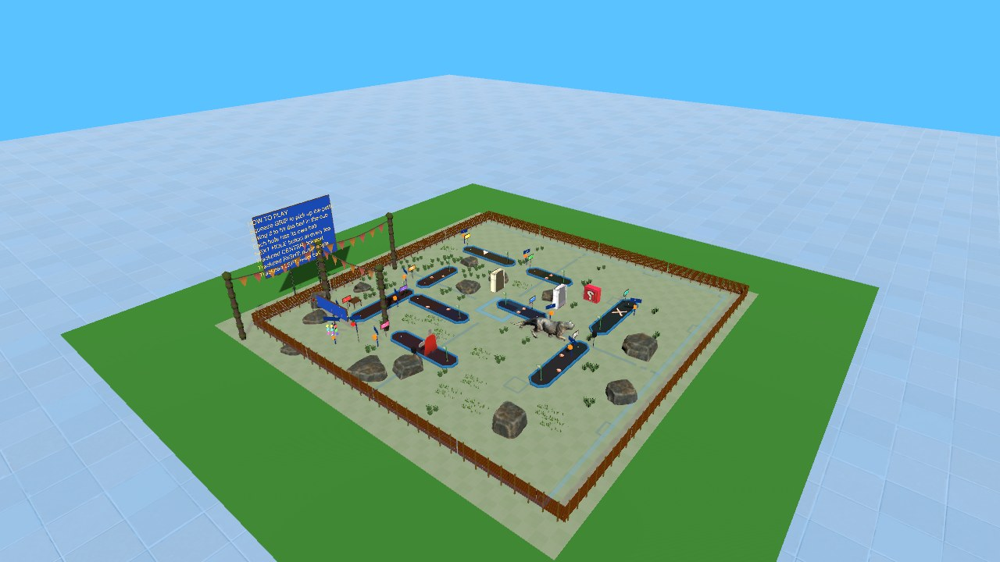
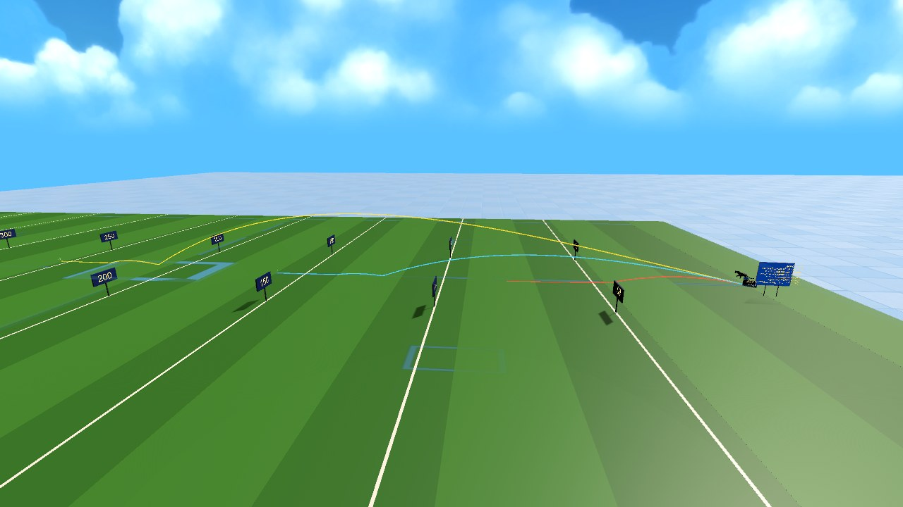
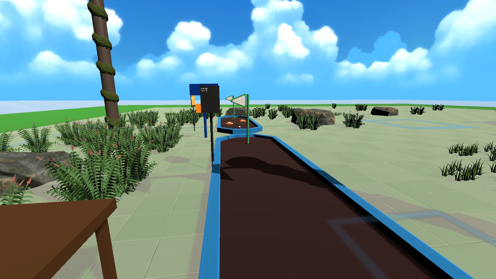
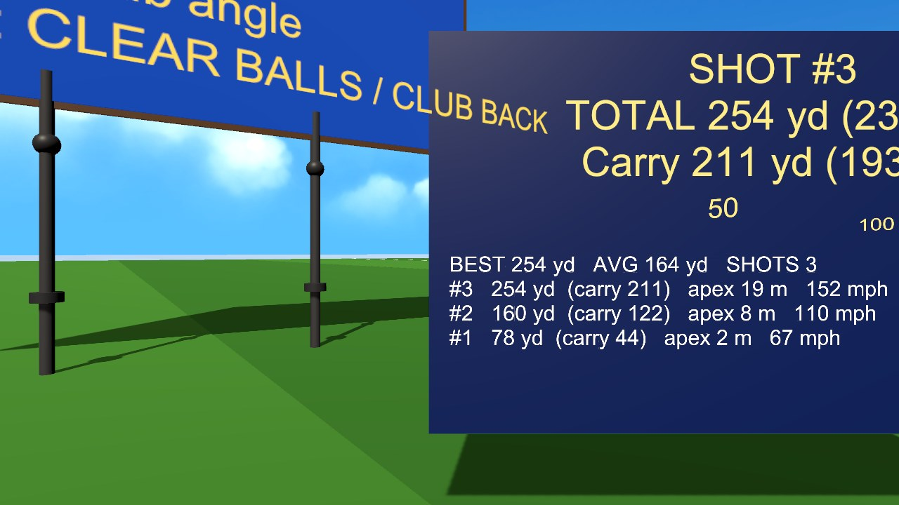

# UPB Alumni Weekend 2026 - VR Lab Showcases

**University of Pittsburgh at Bradford - Marilyn Horne Hall VR Lab**

This repository holds two interactive Virtual / Mixed Reality showcases built for UPB Alumni & Family Weekend 2026:

| Project | What it is | Runs on |
| :--- | :--- | :--- |
| [`panther-builder/`](panther-builder/) | **Panther Customizer** - a WebXR / 3D web app that puts the campus Panther statue in your room and lets you change its finish and size | Any WebXR headset browser (Meta Quest Browser), or a desktop browser |
| [`GolfVR/GolfVR/`](GolfVR/GolfVR/) | **VR Mini Golf + Driving Range** - a Unity / SteamVR experience with a 9-hole course, a 2-hole variant, a driving range, and keyboard scene switching | Windows PC + SteamVR, tested with an **HTC Vive Pro** and Vive wand controllers |

---

## Project 1: Panther Customizer (`panther-builder/`)

An interactive Mixed Reality and 3D web experience built around a photogrammetry scan of the Pitt Bradford Panther statue. Details and screenshots: [`panther-builder/README.md`](panther-builder/README.md).

**Try it now (headset ready):** <https://jcallinan.github.io/Alumni-Weekend-2026/>

### Using it in a headset
1. Open the browser in the headset (e.g. **Meta Quest Browser**).
2. Go to `https://jcallinan.github.io/Alumni-Weekend-2026/`.
3. Click **Enter AR** / **View in Mixed Reality** and allow the permission prompts.
4. Look at the floor or a table and pull the controller trigger to place the Panther.
5. Use the floating panel to switch finishes (Campus Scan, Pitt Royal Blue, Pitt Gold, Cast Bronze, White Marble, Bradford Onyx) and to resize it from a 20 cm desk model up to the 2.7 m life-size statue (or 4 m "monumental").

On a desktop / laptop / tablet it opens in a normal 3D viewer instead - drag to orbit, scroll to zoom.

### Running it locally
Requires [Node.js](https://nodejs.org/) 18+.
```bash
cd panther-builder
npm install
npm run serve      # https dev server at https://localhost:8081 (also reachable from a headset on the same Wi-Fi via your PC's IP)
npm test           # unit tests (node --test)
npm run build      # production bundle into dist/
```
The dev server uses a self-signed certificate; accept the browser warning once (WebXR requires HTTPS).

### Publishing
- **Automatic:** every push to `main` runs `.github/workflows/deploy-pages.yml`, which tests, builds and deploys to GitHub Pages (Repo **Settings -> Pages -> Source: GitHub Actions**).
- **Manual:** `npm run deploy` builds `dist/` and pushes it to the `gh-pages` branch (then set Pages to *Deploy from a branch -> gh-pages*).

---

## Project 2: GolfVR (`GolfVR/GolfVR/`)

A VR mini-golf and golf-practice experience in **Unity 2022.3.62f3** with **SteamVR**, built for the **HTC Vive Pro** (Vive wand controllers). Full technical notes, testing tools and the list of bugs found/fixed are in [`GolfVR/GolfVR/Docs/README.md`](GolfVR/GolfVR/Docs/README.md).

### What's in it
The app **starts in `ICARUS_v1`**. From the keyboard (the PC's keyboard, with the game window focused) you can switch scene at any time - the key list also shows on the monitor for a few seconds after each scene loads (`H` hides/shows it):

| Key | Scene | What it is |
| :--- | :--- | :--- |
| **1** | `ICARUS_v1` (start scene) | The full 9-hole course. **Every hole has its own ball** waiting at its tee; scores per hole, fireworks + horns on every hole sunk, scoreboard that follows you, NEXT HOLE buttons at every tee, a staff reset kiosk and a "pick a hole" test panel |
| **2** | `ICARUS_TwoHole_v1` | Holes 1 and 2 only, with an invisible fence and invisible walls around the fairways |
| **3** | `New_Sample` | Sample / experimental scene |
| **4** | `Dom_v4` | Dom's scene |
| **5** | `ICARUS_DrivingRange_v1` | Hit a driver off a tee: 3D ball flight with a coloured trail, carry + total distance in yards/metres, a history board, and a fresh ball after every shot |
| **Esc** | - | Quit (stops Play mode in the Unity Editor) |

### Scene gallery
A full set of screenshots of every scene (overviews, the start view, a tee view of each hole, and simulated drives with flight paths on the driving range) is in [`GolfVR/GolfVR/Docs/SCENES.md`](GolfVR/GolfVR/Docs/SCENES.md). A taste:

| `ICARUS_v1` (key 1) | `ICARUS_DrivingRange_v1` (key 5) |
| :---: | :---: |
|  |  |
| `ICARUS_TwoHole_v1` (key 2) | `ICARUS_DrivingRange_v1` history board |
|  |  |

### Controls (Vive wand)
| Input | Action |
| :--- | :--- |
| **Grip** | Pick up the putter / driver. It then **stays stuck to your hand** (no need to keep squeezing) |
| **Trigger** | Push buttons / interact |
| **Trackpad - center** | Teleport |
| **Trackpad - right edge** | While holding the club: cycle the club angle (remembered). Otherwise: snap the putter to you |
| **Trackpad - left edge** | Reset the ball in front of you |
| Keyboard `1`-`5` / `Esc` | Switch scene / quit (see above) |

Push-buttons are pressed by poking them with your hand. On the course, the **red reset kiosk** near the start sends all balls back to their tees, clears the scores and puts the putter back on its table; the **hole panel** next to it jumps to any hole (and resets that hole's ball and putter); the small **NEXT HOLE post at each tee** moves you to the next tee without resetting anything.

### Setup on the VR PC
- Windows PC with **SteamVR** installed and the **Vive Pro** working (SteamVR status green).
- **Unity Hub** with Editor **2022.3.62f3**.

### Running it from the Unity Editor
1. Unity Hub -> **Add project from disk** -> select the `GolfVR/GolfVR` folder -> open with 2022.3.62f3.
2. Open **`Assets/Scenes/ICARUS_v1.unity`** (all scenes are already listed in *File -> Build Settings*, with ICARUS_v1 first).
3. Start SteamVR, put the headset on, and press **Play**.
4. Play. Click the Game window once so it has keyboard focus, then press **1-5** to switch scene or **Esc** to quit.

Any scene can be opened directly and played the same way; the number keys work from whichever scene is running.

### Building a standalone Windows player
1. **File -> Build Settings**: confirm `ICARUS_v1` is index 0 and the other scenes are checked (the 1-5 keys need them all enabled).
2. Platform **Windows, Mac, Linux**, architecture **x86_64** -> **Build** into e.g. `GolfVR/Builds/AlumniMiniGolf/`.
3. Start SteamVR, then run the built `.exe`.

### Automated tests (no headset needed)
The project ships editor tests that run in Unity batch mode and are also available in the Editor under **Tools -> GolfVR** (real-physics putt and drive tests, grip geometry, hole and scene-switch checks, and more). To run one headlessly:
```bash
unity run GolfVR/GolfVR --editor-version 2022.3.62f3 -- -executeMethod GolfVR.EditorTools.PhysicsPuttTest.Run -logFile out.log
```
The list of tests and what each checks is in [`GolfVR/GolfVR/Docs/README.md`](GolfVR/GolfVR/Docs/README.md). (`test_golf_logic.py` in the repo root is an older stand-alone simulation of the original scoring rules and is no longer maintained.)

### Troubleshooting
- **SteamVR shows "Headset not detected"** - check the Vive Pro link box/cables, restart SteamVR, then press Play again.
- **Can't pick up the putter** - reach for the shaft and squeeze the **grip**. If the club feels tilted wrong, press the **trackpad right edge** while holding it to cycle the angle.
- **Number keys do nothing** - click the Game window first so it has keyboard focus. If a key says a scene is "not in Build Settings", add it under *File -> Build Settings*.
- **Ball doesn't go in the hole** - it must actually drop into the cup; a slow ball near the cup is gently pulled in.

---

## Studying these projects (CIST 1423)

These two projects are the course's worked examples for Weeks 4–5 and the WebXR module:

| Read this | To learn |
| :--- | :--- |
| [Week 4: SteamVR setup](../Week-04-SteamVR-Setup/README.md) | How `GolfVR` was set up (OpenVR loader, SteamVR Input, Interaction System) |
| [Week 5: SteamVR interactions](../Week-05-SteamVR-Interactions/README.md) | `Interactable` / `Throwable` / `HoverButton` / SteamVR actions, with `GolfPutter`, `QuickResetController` and `ResetRoundButton` as the case study |
| [Meta WebXR samples](../Meta-WebXR-Samples/README.md) and the [Sneaker Builder walkthrough](../Meta-WebXR-Samples/Sneaker-Builder.md) | The Meta sample `panther-builder` was forked from, plus Chairs Etc., RealMeasure, Flap Frenzy and IWSDK |
| [From Sneaker to Panther](panther-builder/FROM-SNEAKER-TO-PANTHER.md) | File-by-file: what was kept, changed, replaced and deleted to build `panther-builder` |
