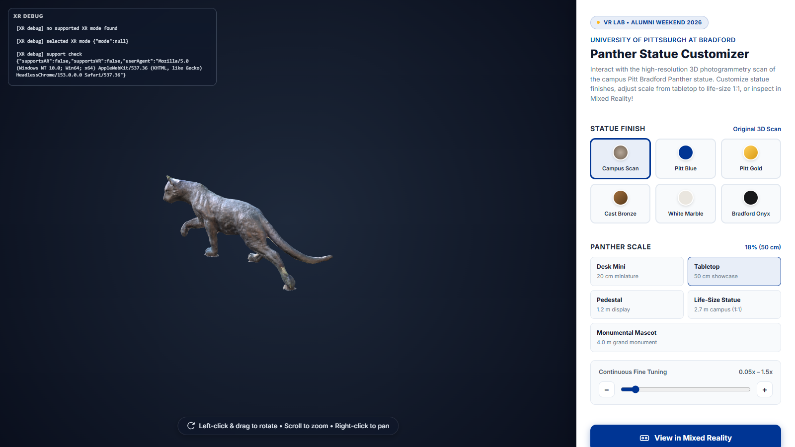
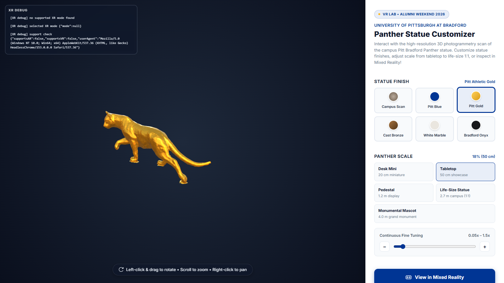

# From Sneaker Builder to Panther Customizer

`panther-builder` is a fork of Meta's
[Sneaker Builder](https://github.com/meta-quest/webxr-showcases/tree/main/sneaker-builder)
(read [the Sneaker Builder walkthrough](../../Meta-WebXR-Samples/Sneaker-Builder.md) first).
This page shows exactly what we kept, changed, replaced, and deleted to turn a
two-shoe MR shopping demo into a one-statue campus showcase for Alumni Weekend 2026.
The lesson: **you don't need to understand a codebase completely before you can
reshape it. You need to know which parts are generic and which parts are the product.**

| Desktop / laptop mode | After picking **Pitt Gold** |
| --- | --- |
|  |  |

*Headless Chrome with no XR device, so the on-page XR debug log (top left) reports "no supported XR mode"
and the button falls back as described in 2.5.*

## 1. The scorecard

Compared line by line against upstream `sneaker-builder/src` (line endings ignored):

| File | Status | Notes |
| --- | --- | --- |
| `player.js` | ✅ **unchanged** | Controller rig, edge detection, raycaster, controller-occlusion shader |
| `follow.js` | ✅ **unchanged** | Lazy-follow UI |
| `pointer.js` | ✅ **unchanged** | Claw/ray pointer visuals |
| `audio.js` | ✅ **unchanged** | Sound-effect "event entities" |
| `global.js` | ✅ **unchanged** | Shared GLTF/Draco/KTX2/EXR loaders |
| `index.js` | ✏️ modified (a few lines) | System list and model loader swapped |
| `scene.js` | ✏️ modified | Added lights; made the 72 Hz request defensive |
| `grab.js` | ✏️ modified | Distance-based grab that scales with the statue |
| `welcome.js` | ✏️ modified | Docks one real statue instead of two shoe clones |
| `landing.js` | ✏️ rewritten | Finish/size UI, slider, **AR → VR fallback**, on-screen XR debug log |
| `constants.js` | 🔁 replaced | Shoe colors → `PANTHER_FINISHES` + `PANTHER_SIZES` |
| `sneaker.js` → `panther.js` | 🔁 replaced | 12-part shoe → single-mesh statue with finish/scale API |
| `size.js` → `pantherSize.js` | 🔁 replaced | Shoe-size logic → statue-scale presets + in-XR size label |
| `configUI.js` | ❌ deleted | The in-headset part/color picker |
| `sizeLayout.mjs` | ❌ deleted | Left/right shoe sizing-panel layout |
| `package.json` dependencies | ✅ unchanged | Same three / elics / ratk / howler / troika versions |

**5 of the 15 source files are untouched**, and those are the *engine* layer: input,
pointer, follow-UI, audio, and loading. Everything we changed is the *product* layer.

## 2. Walkthrough of the changes

### 2.1 `index.js`: swap the product, keep the engine
```diff
-import { ConfigUISystem } from './configUI';
-import { SizingSystem } from './size';
-import { loadSneakers } from './sneaker';
+import { PantherSizingSystem } from './pantherSize';
+import { loadPanther } from './panther';
 ...
-  .registerSystem(SizingSystem)
+  .registerSystem(PantherSizingSystem)
   .registerSystem(InlineSystem)
-  .registerSystem(ConfigUISystem)
   .registerSystem(GrabSystem)
 ...
-loadSneakers(world, global);
+loadPanther(world, global);
```
The ECS makes this surgical. Systems don't call each other. They only share components,
so removing `ConfigUISystem` breaks nothing else.

### 2.2 `panther.js`: a scanned mesh is not a product model
The sneaker is authored: 12 named parts with sub-meshes for stitching. The Panther is a
**photogrammetry scan** (Scaniverse capture → cleaned mesh `Panther_Cleaned.obj` → `panther.glb`, 13 MB; the raw exports are in `../Scaniverse Models/`): one mesh
with one baked texture. So:

- **Find the mesh** by traversing for the first `isMesh`, and keep a clone of its original material.
- **Normalize the pivot.** Scans come in with an arbitrary origin. `Box3` centers X/Z on 0
  and puts the base at Y = 0, so the statue *stands* on a table instead of sinking into it.
- **Scale the inner mesh, not the root.** `setScale()` scales `_mesh`. The grabbable
  `pantherRoot` stays at scale 1, so UI attached to it (the size label) doesn't grow into a
  billboard at 4 m. This decision ripples into `grab.js` (below).
- **Finishes instead of parts.** `setFinish(id)` either restores the original scanned
  material or builds a `MeshStandardMaterial` from `PANTHER_FINISHES` (Pitt Royal Blue
  `#003594`, Athletic Gold `#FFB81C` at metalness 0.85, and so on), reusing the scan's normal map if it has one.
- `pantherRoot.userData.shoeId = 'panther'` is a deliberate shim, so `grab.js`'s
  "which object is this?" lookup keeps working without a rename.

### 2.3 `grab.js`: a grab box that grows with the object
Upstream used a hand-tuned box around a *shoe-sized* object:
```js
// sneaker-builder
localVec3.x > 0.02 - 0.18 && localVec3.x < 0.02 + 0.18 && ...
```
A statue that goes from 20 cm to 4 m needs a threshold that scales:
```js
// panther-builder
const objScale = global.panther ? global.panther.currentScale : intersectObjects[0].scale.x || 1.0;
const grabThreshold = Math.max(0.4, objScale * 0.8);
if (dist < grabThreshold) { ... }
```
Note the comment in the source. Because of 2.2, the *root* is always scale 1, so reading
`object.scale` would be wrong. The code reads `panther.currentScale` instead. The rename
also fixed an upstream typo: `.attahced` → `.attached` in the "skip already-held objects" filter.

### 2.4 `welcome.js`: dock the real thing, not a copy
Upstream hangs the two shoe meshes under the head-locked welcome card and detaches them on
first grab. The Panther version:
- only docks while `renderer.xr.isPresenting` (on desktop the statue stays where `panther.js` put it);
- docks the **real, grabbable root** (`this._welcomePanel.add(panther.root)`), so the grab
  system's `Object3D.attach()` pulls it out naturally, whatever its parent is;
- hides the card once `panther.root.parent !== this._welcomePanel`.

### 2.5 `landing.js`: the web page and the headset door
- **Finish and size controls** are HTML buttons (`.finish-btn`, `.size-btn`) plus a
  continuous slider (0.05× to 1.5×) with ± step buttons. They call `panther.setFinish()`
  / `setScale()` directly and mirror onto a desktop **preview copy** (`panther.createCopy()`),
  because the real XR statue is hidden until a session starts.
- **AR → VR fallback (the big one).** Upstream *requires* `plane-detection`,
  `mesh-detection`, and `anchors`, which only the Quest Browser grants. The VR Lab's Vive
  Pros run WebXR through SteamVR in a desktop browser, which supports only `immersive-vr`.
  So the new code asks first:
  ```js
  const supportsAR = await navigator.xr.isSessionSupported('immersive-ar');
  const supportsVR = await navigator.xr.isSessionSupported('immersive-vr');
  if (supportsAR) ARButton.convertToARButton(arButton, renderer, { requiredFeatures: [], optionalFeatures: ['hit-test', ...] });
  else            VRButton.convertToVRButton(arButton, renderer, { ... });   // 'Enter VR Experience'
  ```
  It also moved every AR feature from *required* to *optional*. The same URL now works in
  a Quest (passthrough MR) and in a SteamVR headset (VR).
- **On-screen XR debug log.** `logXRDebug()` prints the last 12 XR events into
  `#xr-debug-log`. You can't open DevTools inside a headset, so this is how the team
  debugged session start-up on real hardware.
- The "open on your Quest" deep link was replaced with a plain alert, since lab machines aren't Quests.

### 2.6 `pantherSize.js`: presets instead of shoe sizes
- `PANTHER_SIZES`: Desk Mini (20 cm, 0.075×) → Tabletop (50 cm, default) → Pedestal (1.2 m) →
  **Life-Size 1:1 (2.7 m, 1.0×)** → Monumental (4 m). The scan's native scale *is* life size.
- The system polls the HTML controls (`.size-options[data-value]`, slider `data-user-adjusted`),
  which is the same DOM-to-ECS bridge upstream uses for shoe size.
- In XR it builds a Pitt-blue label panel at the statue's feet with gold troika text showing the current size.

### 2.7 `scene.js`: small but instructive
- Added ambient light plus two directional lights. The scan's baked texture looked flat
  under the environment map alone.
- `session.updateTargetFrameRate(72)` is a Quest Browser extension. Other browsers
  (SteamVR through Chrome/Edge) may not have it or may reject 72 Hz, and an unguarded
  call would throw during session start. It is now feature-detected and wrapped in `try`.
  **Lesson:** feature-detect every vendor extension.

## 3. What *didn't* make the cut (good exercises)

| Gap | Where | Idea |
| --- | --- | --- |
| No in-headset finish picker: the HTML panel is hidden in XR | `configUI.js` was deleted | Port it back: hold the statue in one hand, ray at a 6-swatch panel with the other (upstream's `configUI.js` + `sneaker.js` swatch code are 90% of the answer) |
| No in-headset resizing | `pantherSize.js`, the empty `justStartedSelecting` loop at the bottom | Ray the top or bottom of the size panel to step presets, as upstream `size.js` does with `intersect.uv.y` |
| The README promises "tap trigger to place on the floor", but there is no hit-test placement | `landing.js` requests `hit-test` but nothing uses it | Use ratk's `HitTestTarget` to put a reticle on real surfaces and place on trigger |
| Size label says "Tabletop (50 cm)" after you drag the slider to 100% | `setScaleValue()` never clears `_currentScaleIndex` | Track "custom" scale and show the percentage instead |
| `README.md` shows `src/assets/ogimage.png` as the "Panther Showcase" picture, but it is still Meta's sneaker image | `src/assets/ogimage.png` | Replace it with a screenshot of the statue |
| Unused sneaker leftovers ship in the build | `src/assets/`: `mcdonalds.png`, `panda.png`, `stone.png`, `palette.png`, `color_picker_ui.png`, `swatch.glb`, `sizing_panel.png`, `default.png`, `ground_shadow.png` | Delete them (or reuse them for the finish-picker exercise) |
| The README's `.github/workflows/deploy-pages.yml` isn't in this copy | It lives at the root of the original Alumni-Weekend-2026 repo | Use `npm run deploy` (gh-pages branch) from here |

## 4. Try it

```bash
cd Alumni-Weekend-2026/panther-builder
npm install
npm test          # 3 tests: finishes, size presets, panther.glb is a valid glTF 2.0 binary
npm run serve     # https://localhost:8081
```
Live build: <https://jcallinan.github.io/Alumni-Weekend-2026/>

**Where it went next:** [`Week-07-WebXR-WaterWorks`](../../Week-07-WebXR-WaterWorks) forks this project
again into a *multiplayer* water-system builder: many parts, port snapping, and a WebSocket relay.

**Assignment idea:** fork `panther-builder` again and turn it into *your* object.
Scan something on campus, drop the `.glb` in `src/assets/gltf/`, and change
`constants.js`. Then write down, as this page does, which files you *didn't* have to touch.
