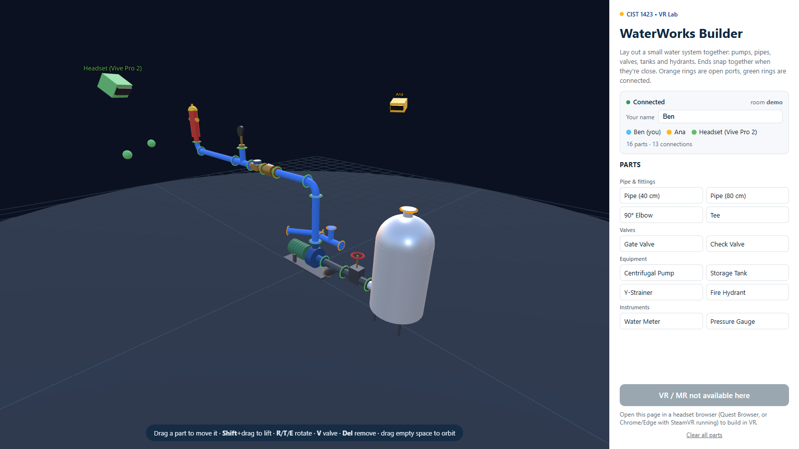

# CIST 1423 — Virtual Reality Programming & Technology — Fall 2026

Weekly example projects, one folder per week, following the course syllabus.

## Weeks

Follows the syllabus; every week has a deck in [`Slide-Decks`](Slide-Decks). **Change from the syllabus:**
Week 7 (*AR Development in Unity II*) is **WebXR building** instead.

| Week | Topic | Example code |
| --- | --- | --- |
| 1 | Intro to course & brainstorming (Ch. 1) | — |
| 2 | Unity Editor & Scene Creation I | [`Week-02-PrimitivesLab`](Week-02-PrimitivesLab), 
| 3 | Unity Editor & Scene Creation II (Exam 1) | — |
| 4 | VR Development in Unity I: SteamVR setup | [`Week-04-SteamVR-Setup`](Week-04-SteamVR-Setup) |
| 5 | VR Development in Unity II: SteamVR Interaction System | [`Week-05-SteamVR-Interactions`](Week-05-SteamVR-Interactions) |
| 6 | AR Development in Unity I: AR Foundation | — |
| 7 | **WebXR building** (replaces AR II) (Exam 2) | [`Meta-WebXR-Samples`](Meta-WebXR-Samples), [`panther-builder`](Alumni-Weekend-2026/panther-builder), [`Week-07-WebXR-WaterWorks`](Week-07-WebXR-WaterWorks) |
| 8 | Midterm project prototype | — |
| 9 | Building interactive VR experiences (Ch. 5) | — |
| 10 | Building interactive AR experiences (Ch. 6) | — |
| 11 | Sound & visual effects (Ch. 7) (Exam 3) | GolfVR's procedural audio and fireworks |
| 12 | Advanced XR: hands, gaze, multiplayer (Ch. 8) | [`Week-07-WebXR-WaterWorks`](Week-07-WebXR-WaterWorks) (relay + avatars) |
| 13 | Best practices, trends & collaboration (Ch. 9) | — |
| 14 | Testing & polishing | GolfVR editor tests, WaterWorks `npm test` |
| 15 | Final showcase | — |
| 16 | Final exam | — |

## Alumni & Family Weekend 2026

[`Alumni-Weekend-2026`](Alumni-Weekend-2026) holds the two finished lab showcases:

- [`GolfVR`](Alumni-Weekend-2026/GolfVR/GolfVR): a Unity + SteamVR 9-hole mini-golf course (Vive Pro). This is the Week 4–5 case study.
- [`panther-builder`](Alumni-Weekend-2026/panther-builder): a WebXR Panther statue customizer forked from Meta's Sneaker Builder.
  [`FROM-SNEAKER-TO-PANTHER.md`](Alumni-Weekend-2026/panther-builder/FROM-SNEAKER-TO-PANTHER.md) explains every change.

