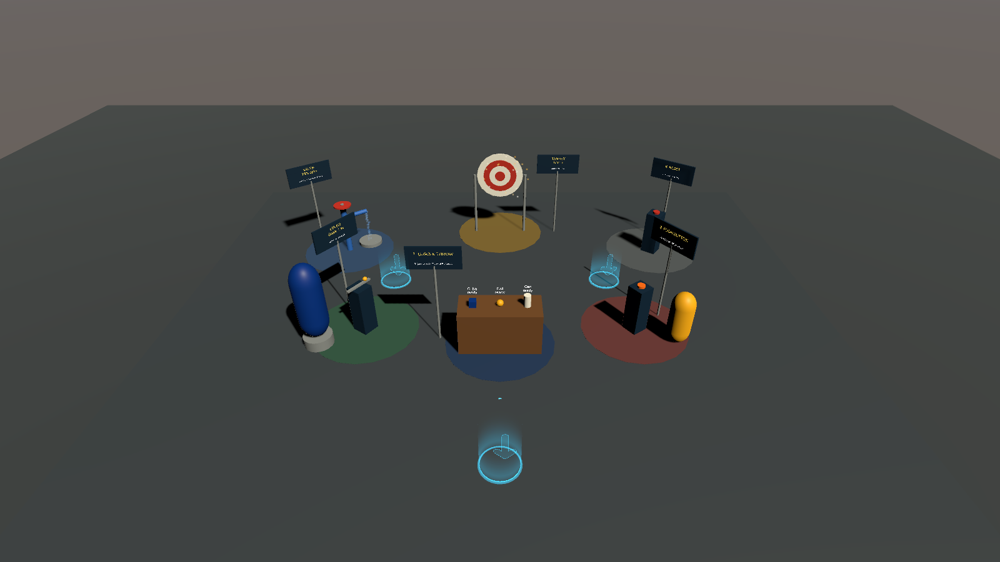
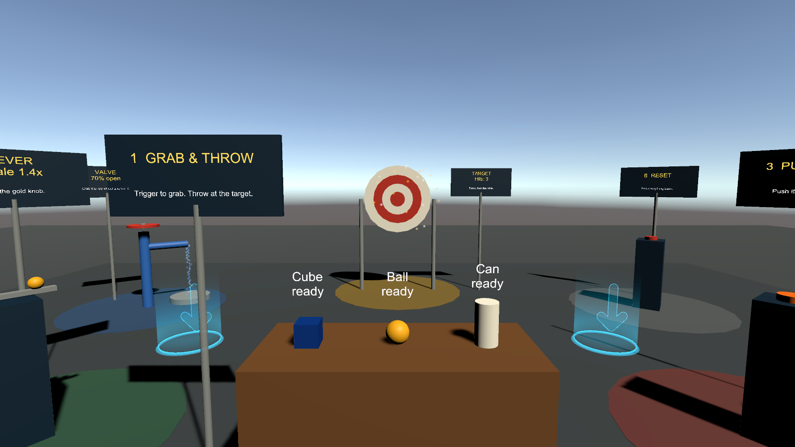
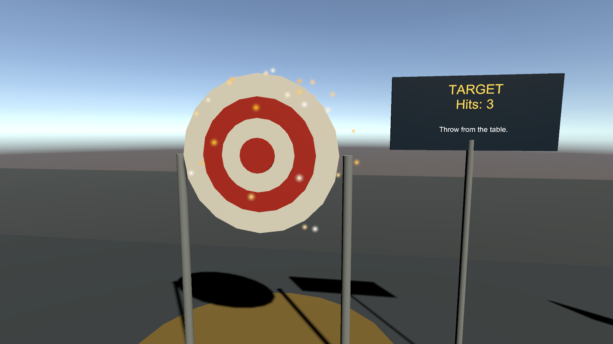
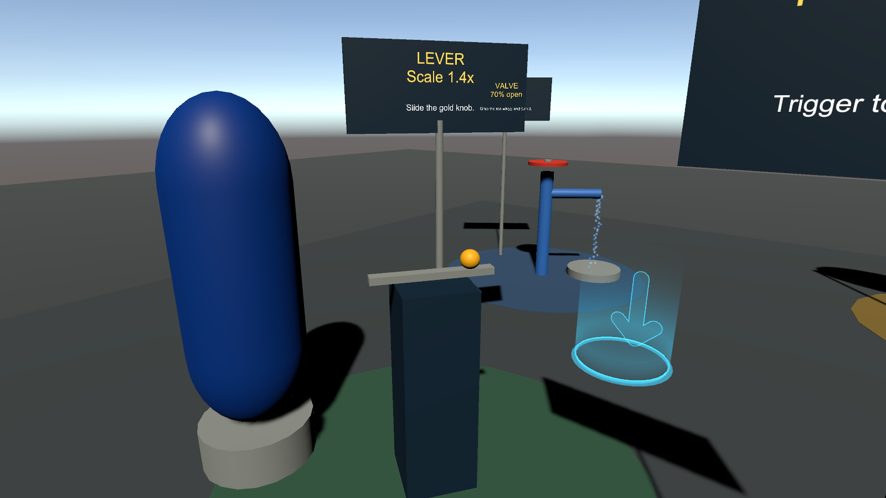
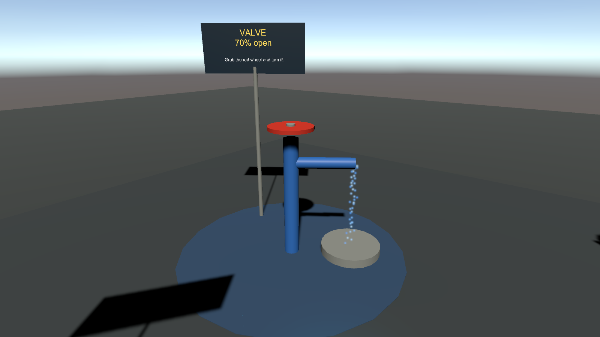

# Week 5 — VR Development in Unity II: the SteamVR Interaction System

> **Syllabus:** Ch. 3 (second half). The textbook tours the *XR Interaction Toolkit*
> demo scene. We tour SteamVR's equivalent, `Interactions_Example.unity`, and then
> build our own test scene from the same parts. Setup comes from [Week 4](../Week-04-SteamVR-Setup).

**Deliverable:** Document your interaction test (teleport + grab) in Markdown with
screenshots or a short clip. Push your code and `README.md`.

---

## 1. Tour: `Interactions_Example.unity`

Open `Assets/SteamVR/InteractionSystem/Samples/Interactions_Example.unity` and walk
the room. Each station demonstrates one component. The components are the same
Lego bricks you'll use in the lab.

| Textbook (XRI) concept | SteamVR Interaction System | Where to find it in the sample |
| --- | --- | --- |
| XR Origin / player rig | **`Player`** prefab: `VRCamera`, `LeftHand`, `RightHand`, and a 2D fallback | `Core/Prefabs/Player.prefab` |
| Teleportation Provider | **`Teleporting`** prefab: draws the arc and moves the player | `Teleport/Prefabs/Teleporting.prefab` |
| Teleportation Area | **`TeleportArea`** on any mesh with a collider | The floor |
| Teleportation Anchor | **`TeleportPoint`** prefab: fixed pads, can switch scenes | Pads around the room |
| XR Grab Interactable | **`Interactable`** + **`Throwable`** | Table of throwables |
| Interactable events | `Interactable.onAttachedToHand` / `onDetachedFromHand`, `Hand.AttachObject` | — |
| UI button | **`UIElement`** on a uGUI `Button` | Floating UI panel |
| Physical/poke button | **`HoverButton`** (moves a `movingPart`, fires `onButtonDown`) | Push buttons |
| Lever / dial | **`LinearDrive`** / **`CircularDrive`** | Slider and wheel stations |
| Gaze interaction | No gaze component in SteamVR. Hand hover is the default (a raycast from `VRCamera` works as gaze) | — |
| Climbing | Not in the stock sample. The **Longbow** and **Buggy Buddy** mini-games show two-handed and vehicle attachment instead | `Samples/`, `Longbow/` |
| XR Device Simulator | `Player` → **Allow Toggle To 2D** (keyboard and mouse fallback) | Runs automatically when no headset is found |

### How grabbing actually works

1. Each `Hand` has a small **hover sphere**. Every frame it asks "which `Interactable`s
   am I touching?" and highlights the closest one.
2. When the `GrabPinch` (trigger) or `GrabGrip` action goes down, the hand calls
   `hand.AttachObject(obj, grabType, attachmentFlags)`.
3. `attachmentFlags` decide the feel. `Throwable` defaults to
   `ParentToHand | DetachFromOtherHand | TurnOnKinematic`. GolfVR's putter adds
   **`SnapOnAttach`**, so the grip lands exactly in your palm.
4. On release, `Throwable` reads the hand's velocity estimate and applies it to the
   `Rigidbody`. That is why thrown objects keep your arm's speed.

## 2. Lab: build the SteamVR Playground

An Editor menu command builds the scene from primitives (the Week 2 lab's ground + prop + object idea), so
nothing is hand-placed. Re-running it deletes and rebuilds `SteamVR_Playground`, so it is always safe.


*Six numbered stations arranged around the start point. The teleport area (the whole floor in front of you)
only lights up while you aim a teleport.*

1. In your Week 4 project, copy this folder's `Assets/Scripts` and `Assets/Editor` into your `Assets/`.
2. **SteamVR Playground → Build Test Scene.** Then save the scene.
3. Put on the headset and press **Play**. Work through the stations in order. Each sign says what to do.

| # | Station | Built from | Try it | Teaches |
| --- | --- | --- | --- | --- |
| 1 | **Grab & throw** table | `Throwable` + `GrabReporter` + `ResettablePose` | Grab (trigger), throw; watch the label and Console | `Interactable` events, haptics, release velocity |
| 2 | **Target** board | `ThrowTarget` (BoxCollider) | Hit it from the table: score, sparks, chime | `OnCollisionEnter`, relative velocity, particles + audio feedback |
| 3 | **Push button** | `HoverButton` + `PittColorButton` | Push the cap down: the capsule cycles Pitt colours | `HoverButton.onButtonDown` (`UnityEvent<Hand>`) |
| 4 | **Lever** | `LinearDrive` + `LinearMapping` + `LeverScaler` | Slide the gold knob: the statue grows and shrinks | A physical "slider" → a 0–1 value → your script (Ch. 5's slider-scale) |
| 5 | **Valve wheel** | `CircularDrive` (2 turns) + `ValveFlow` | Turn the red wheel: water flow follows | Rotational input, driving a `ParticleSystem` from a value |
| 6 | **Reset kiosk** | `HoverButton` + `ResetStation` | Press it: everything goes home, score resets, spawned cubes vanish | GolfVR's "reset for the next player" pattern |
| — | Teleport area + 3 pads | `TeleportArea`, `TeleportPoint` | Trackpad to aim, release to go | Locomotion |
| — | Menu button | `MenuButtonSpawner` | Menu button drops a new cube in front of you | Reading a SteamVR **action** directly |

| | |
| --- | --- |
|  |  |
| **From the start point.** Table in front, target behind it, lever and valve to the left, button and reset to the right. | **Target** after three hits (the sparks are the hit burst). |
|  |  |
| **Lever** at 85% → statue at 1.4×. The sign doubles as a live readout. | **Valve** 70% open → a proportional water stream into the basin. |

> Screenshots were rendered in Unity 2022.3.62f3 batch mode inside the GolfVR project (SteamVR 2.8).
> The same run compiled every script and checked the station logic in Edit mode: the lever scales the statue,
> the valve sets the emission rate and label, reset returns a moved ball, the target starts at zero, and both
> particle systems have a material. All checks passed.

### The scripts

| File | Concept | Real-project counterpart |
| --- | --- | --- |
| [`Scripts/GrabReporter.cs`](Assets/Scripts/GrabReporter.cs) | Subscribing to `Interactable` grab/release events; `Hand.TriggerHapticPulse` | GolfVR `GolfPutter.cs` (`OnAttached`/`OnDetached`, haptic on ball strike) |
| [`Scripts/ThrowTarget.cs`](Assets/Scripts/ThrowTarget.cs) | Collision filtering (only thrown `Throwable`s, only fast hits, one bounce = one hit); feedback triple: score + particles + sound | GolfVR `GolfHole.cs` (sink → fanfare + confetti) |
| [`Scripts/PittColorButton.cs`](Assets/Scripts/PittColorButton.cs) | `HoverButton.onButtonDown` as a `UnityEvent<Hand>` | GolfVR `ResetRoundButton.cs` |
| [`Scripts/LeverScaler.cs`](Assets/Scripts/LeverScaler.cs) | Reading a `LinearMapping` (0–1) written by `LinearDrive` | panther-builder's scale slider (web) |
| [`Scripts/ValveFlow.cs`](Assets/Scripts/ValveFlow.cs) | `CircularDrive` → `LinearMapping` → `ParticleSystem` emission | WaterWorks gate valve (web) |
| [`Scripts/ResetStation.cs`](Assets/Scripts/ResetStation.cs) + [`ResettablePose.cs`](Assets/Scripts/ResettablePose.cs) | Remember start poses; never reset something that's in a hand | GolfVR `ResetRoundButton.cs` / `MiniGolfGameManager.ResetForNextGroup` |
| [`Scripts/PlaygroundAudio.cs`](Assets/Scripts/PlaygroundAudio.cs) | Procedural sound with `AudioClip.Create` (no audio files) | GolfVR's putt, fanfare, and horn clips |
| [`Scripts/MenuButtonSpawner.cs`](Assets/Scripts/MenuButtonSpawner.cs) | Reading a **SteamVR Input action** directly (`SteamVR_Action_Boolean.GetStateDown`) | GolfVR `QuickResetController.cs` |
| [`Editor/BuildSteamVRPlayground.cs`](Assets/Editor/BuildSteamVRPlayground.cs) | Building a scene from code: stock prefabs, stations, signs, particle materials | Week 2 Primitives Lab (same shapes, now built from code) |

### Two ways to read input: know which one you need

```csharp
// 1) Let the Interaction System handle it: you only react to events.
interactable.onAttachedToHand += hand => Debug.Log($"grabbed by {hand.handType}");

// 2) Read an action yourself, for anything that isn't grab/hover.
SteamVR_Action_Boolean menu = SteamVR_Input.GetAction<SteamVR_Action_Boolean>("default", "Menu");
if (menu.GetStateDown(SteamVR_Input_Sources.Any)) { /* ... */ }
```

Use (1) whenever you can. Use (2) for buttons with game meaning ("reset", "open menu").
Always read **actions**, never raw buttons. Each player's controller type then works
through its own bindings file. (GolfVR was built for Vive Wands and still runs on
Index and Quest because of this.)

## 3. Deploying and testing

| Target | How | Notes |
| --- | --- | --- |
| **Editor + SteamVR** | Press Play with the headset on | Fastest loop. What you'll use 95% of the time |
| **2D fallback** | Press Play with SteamVR closed | Keyboard and mouse. Good for testing logic at home |
| **Windows build** | File → Build Settings → PC, Mac & Linux Standalone → Build | The `.exe` launches SteamVR itself. Copy the whole folder, not just the `.exe` |
| **Meta Quest** | Quest Link or Steam Link, then SteamVR as above | The Quest shows up as an `oculus_touch` controller. Bindings come from `bindings_oculus_touch.json` |

## 4. Case study: GolfVR (Alumni Weekend 2026)

[`Alumni-Weekend-2026/GolfVR`](../Alumni-Weekend-2026/GolfVR) is a full 9-hole mini-golf
course built on exactly these parts. Read it in this order:

1. **`GolfPutter.cs`**: an `Interactable` + `Throwable` with a custom `gripPoint`.
   It estimates club-head velocity in `FixedUpdate`, converts it to an impulse on the
   ball in `OnCollisionEnter`, then buzzes the holding hand.
2. **`QuickResetController.cs`**: repurposes the unused snap-turn actions as
   beginner-friendly "fetch putter" and "reset ball" buttons, using
   `Player.instance.feetPositionGuess` / `bodyDirectionGuess` to place things in
   front of the player.
3. **`ResetRoundButton.cs`**, **`GoToHoleButton.cs`**, **`JumpToHoleButton.cs`**: all
   `HoverButton`s. Event staff reset the course between groups without taking off a headset.
4. **`MiniGolfGameManager.cs`** / **`ScoreboardUI.cs`**: ordinary Unity game logic.
   Notice how *little* of the project is VR-specific.
5. `Docs/README.md` covers the Edit-mode test tools (reflective playtests and a
   physics putt test) the team used to test without a headset.

---

## Deliverable template

```markdown
# Week 5 — Teleport + grab test (<your name>)

## Scene
- Built with: SteamVR Playground builder / my own scene
- Headset / controllers:

## Teleport test
- [ ] Teleport arc appears on trackpad press
- [ ] Teleported onto the TeleportArea
- [ ] Teleported onto a TeleportPoint
Screenshot / clip:

## Grab test
- [ ] Grabbed and threw each object (paste Console lines from GrabReporter)
- [ ] Felt the haptic pulse on grab
- [ ] Hit the target at least 3 times (screenshot the score)
- [ ] Pressed the push-button, moved the lever, turned the valve
- [ ] Used the reset kiosk
Screenshot / clip:

## One change I made
(e.g. new attachment flags, a new HoverButton action, a new SteamVR action)

## What surprised me
```
