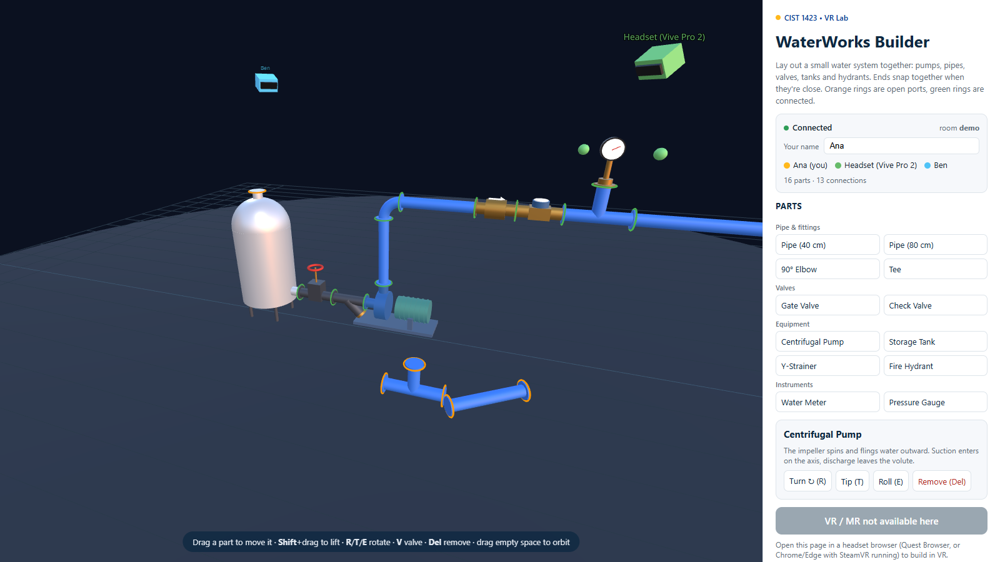
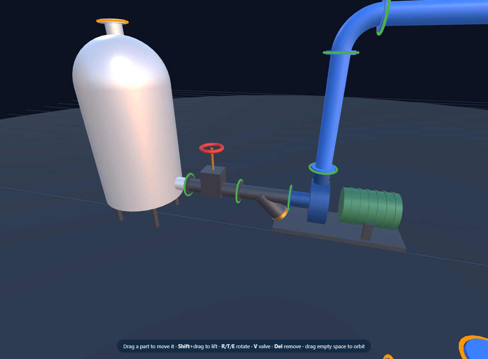
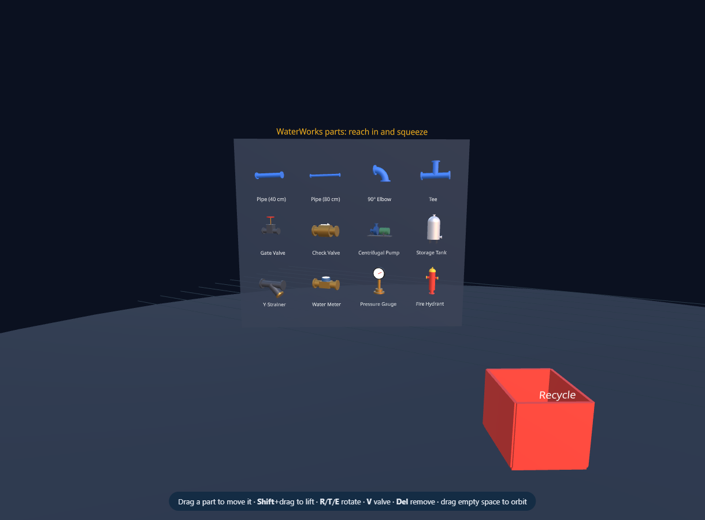
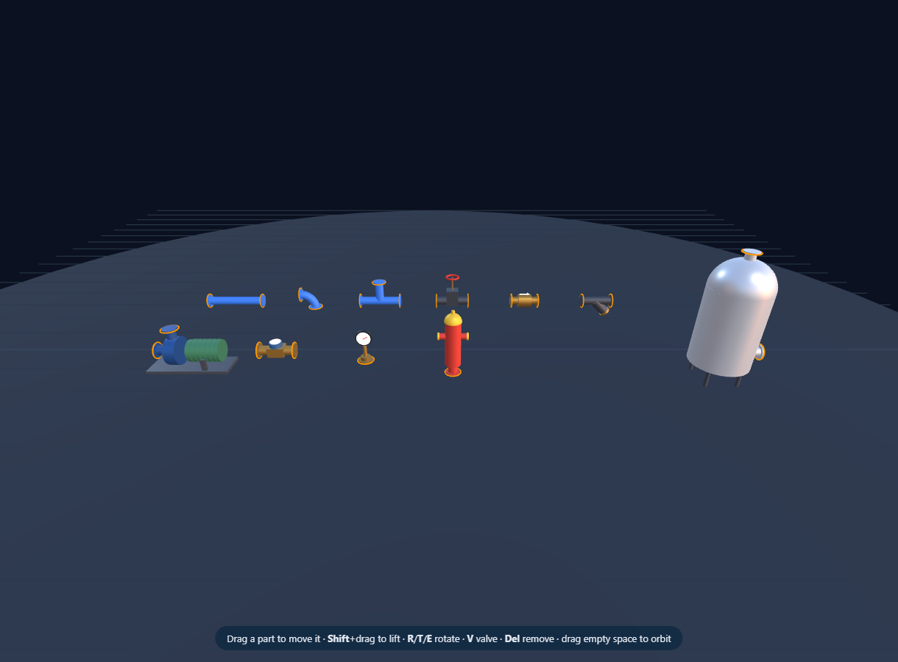

# Week 7 — WebXR Building: WaterWorks Builder (multiplayer)

> **Syllabus change:** Week 7 was *AR Development in Unity II* (AR Foundation plane detection and
> touch placement). We use that week to **build in WebXR** instead: one URL that runs in a Quest
> (passthrough MR), a Vive Pro 2 through SteamVR (VR), and any laptop browser.
> The Week 12 multiplayer topic (textbook Ch. 8, PUN) comes back to this project's networking.

WaterWorks Builder is a **multiplayer WebXR sandbox for laying out a small water system**:
storage tank → gate valve → Y-strainer → centrifugal pump → riser → check valve → meter →
tee with pressure gauge → main → hydrant. Everyone in the same room sees the same parts, sees
each other's heads and hands, and only one person can hold a part at a time.

It is a fork of [`panther-builder`](../Alumni-Weekend-2026/panther-builder), which is a fork of Meta's
[Sneaker Builder](../Meta-WebXR-Samples/Sneaker-Builder.md). The engine layer is unchanged; the
product layer is new. The statue became a catalog of parts, a single object became many, and the app went from one player to many.


*Ben's browser view. Ana (yellow, a desktop builder) and a Vive Pro 2 user (green, head + two hands)
are in the same room. Both browsers show 16 parts and 13 connections.*

| | |
| --- | --- |
|  |  |
| **Desktop mode.** Palette on the right, click a part to see what it does and to turn it, tip it, roll it, or remove it. The people list shows who is in the room. | **Snapping.** Ports turn **green** when connected and stay **orange** when open. |
|  |  |
| **In the headset**, a parts shelf appears in front of you. Reach into a miniature and squeeze to pull out a full-size part. Drop parts in the red bin to recycle them. (Shown here with `?shelf` on desktop.) | **The catalog.** Every part is built from three.js primitives in `src/parts.js`, so there are no model files to manage. |

## Run it

```bash
cd Week-07-WebXR-WaterWorks
npm install
npm test          # 25 tests: every part's ports, snapping maths, room rules, and a live 2-client relay test
npm start         # build + serve everything at https://<this-PC>:8443  (relay included)
```

`npm start` prints a URL for every network adapter. Open the same URL in each headset and laptop
on the lab Wi-Fi, accept the self-signed certificate once, and you're all in room `lab`.
Add `?room=team3` for a private room.

| Where | How |
| --- | --- |
| **Quest (MR)** | Quest Browser → the URL → **Build in Mixed Reality**. Your real floor is the floor. |
| **Vive Pro 2 (VR)** | Start SteamVR, then open the URL in Chrome or Edge on the PC → **Build in VR** |
| **Laptop** | Any browser. Drag parts; the keys are listed at the bottom of the 3D view |
| **Dev with hot reload** | `npm run relay` in one terminal, `npm run serve` in another → https://localhost:8081 (the dev server proxies `/ws` to the relay) |
| **GitHub Pages** | Static hosting can't run the relay. The page runs single-player, or add `?server=wss://your-relay/ws` |

### Controls

| Headset | Desktop |
| --- | --- |
| Reach into a part + **trigger** = grab · let go = place (snaps to a nearby open port) | **Drag** = slide on the floor · **Shift+drag** = lift / lower |
| Reach into a shelf miniature + trigger = pull out a new part | Click a palette button = new part |
| Point at a miniature + trigger = spawn it in front of the shelf | **R** / **Shift+R** turn · **T** tip · **E** roll |
| Point at a gate valve's red wheel + trigger = open / close | **V** = open / close the selected valve |
| Drop in the red bin, or **B / Y** while holding = delete | **Del** = remove · **Esc** = deselect |
| **A / X** = bring the shelf back in front of you | Drag empty space = orbit · scroll = zoom |

## How it's built

```
src/
  index.js      ECS wiring. Registration order = execution order (same as Sneaker Builder)
  player.js     \
  pointer.js     |  unchanged from panther-builder / Sneaker Builder ("engine layer")
  follow.js      |
  audio.js       |
  global.js     /
  scene.js      unchanged from panther-builder (lights, EXR environment, 72 Hz request)
  parts.js      NEW: the catalog: 11 part types, procedural meshes, ports {pos, dir}
  snap.js       NEW: pure maths: find the nearest facing port, rotate + slide to meet it
  workspace.js  NEW: every part in the scene by id; the one place parts are added/moved/removed
  grab.js       generalised: many parts, shelf spawners, recycle bin, network ownership
  shelf.js      NEW: in-headset parts shelf, ray-click spawning, valve wheels
  desktop.js    NEW: mouse building, HTML palette, people list, AR → VR button fallback
  network.js    NEW: WebSocket client (offline-first) + NetworkSystem (15 Hz pose/move)
  avatars.js    NEW: other people's heads, hands and name tags
server/
  rooms.mjs     room rules (pure, unit-tested): snapshot for late joiners, one holder per part
  server.mjs    HTTPS static server + WebSocket relay on one port (self-signed cert)
```

### The multiplayer model in one table

| You do | Your client sends | Server | Everyone else |
| --- | --- | --- | --- |
| join | `join {room, name}` | adds you, replies `welcome` with **all peers + all parts** | `peer-join` |
| pull a part off the shelf | `spawn {part, held:true}` | stores it | part appears |
| grab | `grab {id}` | **grants only if nobody holds it**, else `grab-denied` to you | stop being able to grab it |
| carry | `move {id,p,q}` ×15/s | stores the pose (holder only) | part glides (lerp/slerp) |
| let go | `release {id,p,q}` | stores the final (snapped) pose | part settles and re-snaps |
| turn a valve | `state {id,'closed'}` | stores it | wheel drops, turns dark red |
| leave / disconnect | (socket closes) | drops anything you held | `peer-leave`, `release` |

The server is a **relay with memory**: it doesn't simulate anything, it forwards messages and
keeps the latest part list so late joiners get a snapshot. Compare Photon PUN in the textbook (Ch. 8),
where a cloud service plays this role and `PhotonView` ownership plays the role of `heldBy`.

## Exercises

1. **Flow check.** Walk the connected graph from each pump. If it reaches a tank and a hydrant
   with every gate valve open, animate the pipes (scroll a texture) and swing the gauge needle.
2. **Pipe sizes.** Give ports a diameter and only snap matching sizes. Add a reducer fitting.
3. **Undo.** Keep a per-client history of `spawn`/`release`/`delete` and send the inverse.
4. **Persistence.** Save a room's parts to JSON on the server, and add a "load layout" button.
5. **Hit-test placement (MR).** Use ratk's hit-test to put the shelf on a real table.
